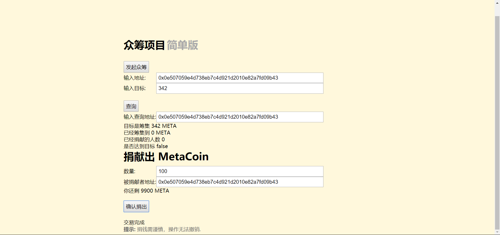

[toc]
# 简单众筹项目
## 选题背景和依据
前面想要做的两个项目分别是商品溯源以及游戏电子钱包， 第一个项目以及被否决了， 游戏电子钱包又不知道具体该怎么做， 除了转账功能不知道还要什么功能可以添加， 所以想换一个题目， 因为最近朋友圈有两三个同学， 在发众筹， 因为家中有人突然患病， 家里一时负担不起，所以才想着用众筹。众筹项目也算是区块链的标准项目之一了，再加上有实际意义，所以选择这个题目， 其实想捐款这种事情， 在以前也被推上推上风口浪尖， 因为筹集的善款不知去向， 所以安全性问题， 以及交易的过程问题可以很好的被区块链解决。相对于电子钱包来说， 众筹不仅有实际意义， 还可以附加很多功能， 可以记录信息，而且还有很多的扩展空间， 我目前准备做的只是专注于众筹本身，也就是暂时先不管筹集的资金的后续， 但是扩展应该是容易的。 提供的接口就是转资金， 查看筹集进度信息等。 其实也涉及到很多细节问题， 比如一个人赞助多次，或者自己赞助自己之类的， 这些问题后续还要再思考， 或者直接以交易为单位， 而不是以发起者为单位， 这样所有的信息都会保留。
## 使用说明
因为与配置好的初始项目有借鉴之处，直接在初始项目上增加之前的代码。

整体环境是```turffle```和```Ganache```
- 首先在一个命令行里面输入```ganache-cli```，创建十个地址
- 然后新开一个命令行输入```truffle migrate --network ganache```，没有问题的话就输入```cnpm run dev```运行项目
- 最后打开浏览器输入```http://localhost:8080/```即可看到项目

注意点
- 如果合约改动则先输入```truffle compile```然后从第二步继续执行。
- 用```cnpm```命令而不用```npm```命令，否则可能会有冲突

具体操作
- 发起众筹功能，输入是地址和目标金额，按下发起众筹按钮就会发起一个众筹。
- 查询信息功能，输入是地址，按下查询按钮就可以看到该地址众筹的目标金额，已经筹集到的金额，已经有多少次募捐，是否完成目标。
- 捐款功能，输入是目标地址以及金额，按下确认捐出按钮就会捐款。
- 最下面提示上面会显示状态，包括发起众筹的状态，交易的状态等。
## 测试
部署成功


项目就一个界面，初始界面如下


从```ganache```中生成的十个地址里选一个，这里选序号是二的地址


输入地址以及目标金额，这里是序号是二的地址，目标是342，状态显示的是发起成功


点击查询按钮，可以看到目标金额是342，正确


数据捐赠地址以及数额，这里先输入100,显示还剩9900，因为一开始初始化都为10000



再点击查询按钮，可以看到数据更新，正确显示


再捐赠一次，输入金额300，保证达成目标,再查询一次，发现目标达成,此时即使再转入金额也无效

